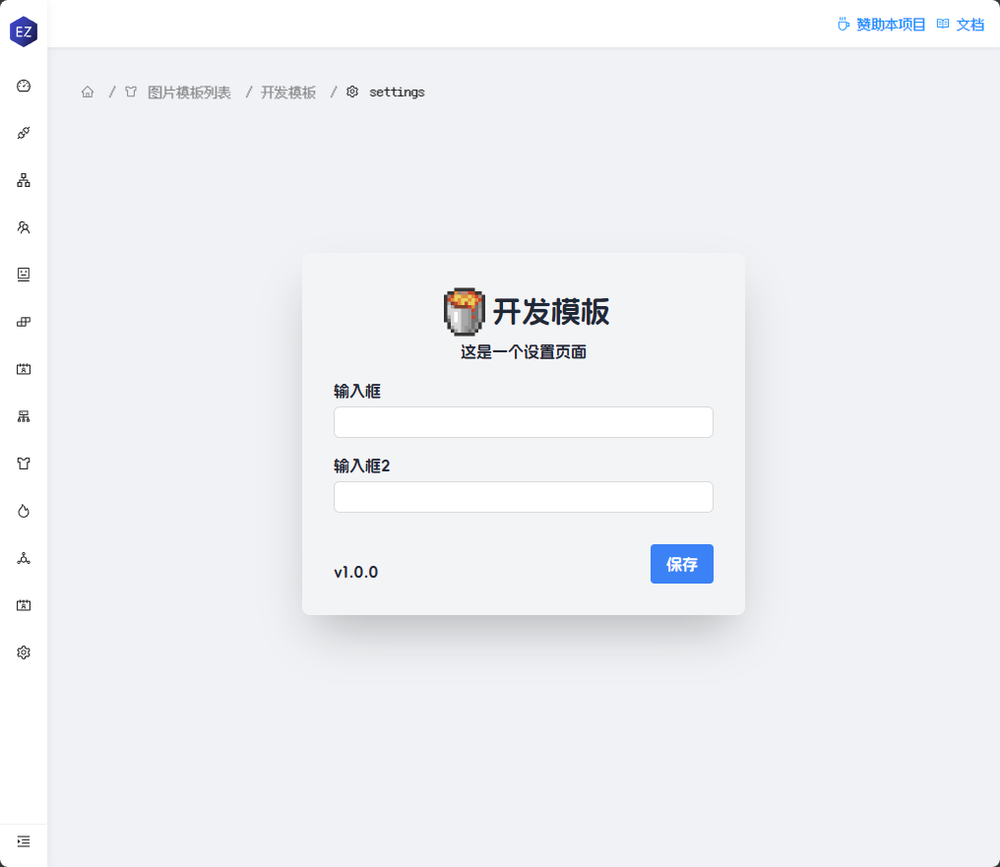
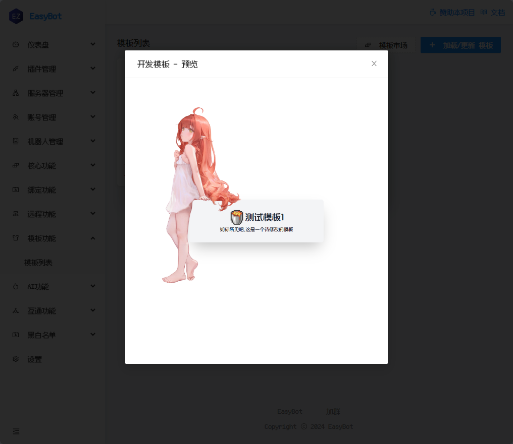

# 图片模板

这个模板是一个 Easybot 图片模板, 帮助你快速开发


## 文档

[📕文档](https://docs.hualib.com/template/)

## 注意

此模板需要`EasyBot v1.3.3`以上的版本,不可在旧版本 EasyBot 上运行！

## 使用

```shell
git clone https://github.com/zkhssb/easybot-react-vite-template.git
cd easybot-react-vite-template
npm i
npm run build
```

## 模板列表

### 设置



## 模板一号


