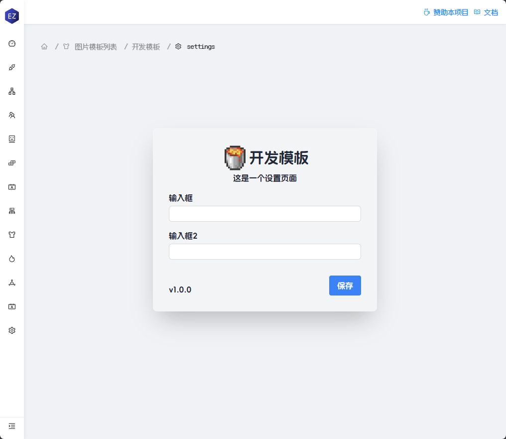
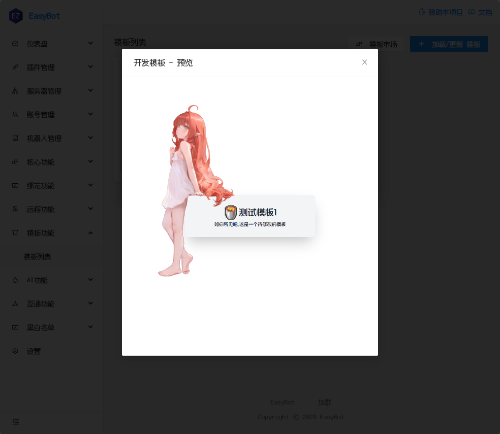

# 图片模板

> 这个模板是一个 Easybot 图片模板, 帮助你快速开发


## 注意事项

1. `main`分支只有基础的一个模板,换到`full`分支可以看到完整的模板的开发示例
   
2. 此模板需要`EasyBot v1.3.3`以上的版本,不可在旧版本 EasyBot 上运行！
## 文档

[📕文档](https://docs.inectar.cn/docs/easybot/dev/image_template/)

## 使用

```shell
git clone https://github.com/zkhssb/easybot-react-vite-template.git
# 或者 gh repo clone zkhssb/easybot-react-vite-template

cd easybot-react-vite-template

npm install
# 或者 npm i

npm run build
```

## 模板列表

### 设置



### 模板一号


