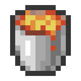

  
  <h1 style="margin-top: 10px;">图片模板</h1>
  
这个模板是一个 Easybot 图片模板, 帮助你快速开发

  

    
    
    
    
  

  

    <a href="https://docs.hualib.com/template/">📕文档</a>
  

## 模板列表

### 设置

## 模板一号

